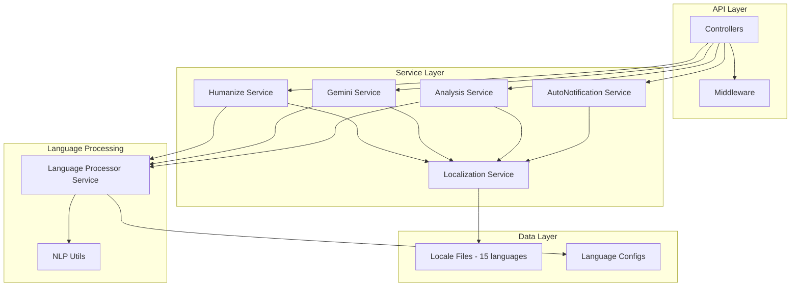

# Design Document: Deep Backend Localization

## Overview

Tài liệu này mô tả thiết kế chi tiết cho việc tùy biến sâu backend chính (`/backend`) để hỗ trợ đầy đủ 15 ngôn ngữ với chất lượng cao. Mục tiêu là đảm bảo các tính năng AI (rewrite, humanize, AI detection, analysis) hoạt động tốt cho từng thị trường cụ thể.

### Mục tiêu chính
1. **Content-Aware Processing** - Xử lý văn bản dựa trên ngôn ngữ nội dung, không phải UI language
2. **Language-Specific Quality** - Chất lượng output phù hợp với đặc điểm từng ngôn ngữ
3. **User-Friendly Experience** - Thông báo lỗi và notifications thân thiện, không kỹ thuật
4. **Complete Localization** - Tất cả messages được dịch đầy đủ cho 15 ngôn ngữ

## Architecture



## Components and Interfaces

### 1. Enhanced Localization Service

**File:** `backend/src/services/localization.service.js`

**Responsibilities:**
- Dịch messages theo ngôn ngữ người dùng
- Format số, ngày, tiền tệ theo locale
- Xử lý pluralization theo quy tắc từng ngôn ngữ
- Chuyển đổi error codes thành user-friendly messages

**Interface:**
```javascript
class LocalizationService {
  // Core translation
  translate(key, lang, params) → string
  t(key, lang, params) → string  // shorthand
  
  // Locale-aware formatting
  formatNumber(value, lang, options) → string
  formatDate(date, lang, format) → string
  formatCurrency(amount, lang, currency) → string
  formatDuration(seconds, lang) → string
  
  // Pluralization
  pluralize(key, count, lang, params) → string
  
  // Error handling
  createUserFriendlyError(errorCode, lang, context) → object
  sanitizeErrorMessage(error, lang) → string
  
  // Validation
  hasTranslation(key, lang) → boolean
  getMissingKeys(lang) → array
}
```

### 2. Enhanced Humanize Service

**File:** `backend/src/services/humanize.service.js`

**Responsibilities:**
- Nhận diện ngôn ngữ văn bản trước khi xử lý
- Áp dụng patterns nhân hóa riêng cho từng ngôn ngữ
- Tạo AI prompts với language-specific instructions

**Interface:**
```javascript
// Language-specific humanization patterns
const HUMANIZATION_PATTERNS = {
  vi: {
    particles: ['à', 'nhé', 'nha', 'ạ', 'nhỉ', 'đấy', 'thôi'],
    fillers: ['thực ra', 'nói chung', 'kiểu như', 'cơ bản là'],
    starters: ['Nói thật', 'Thực ra', 'Mình nghĩ', 'Theo mình'],
    contractions: [] // Vietnamese không có contractions
  },
  zh: {
    particles: ['吧', '呢', '啊', '嘛', '呀', '哦', '哈'],
    fillers: ['其实', '说实话', '基本上', '大概'],
    starters: ['说实话', '其实', '我觉得', '个人认为'],
    contractions: []
  },
  ja: {
    particles: ['ね', 'よ', 'な', 'かな', 'けど', 'さ'],
    fillers: ['まあ', 'ちょっと', '実は', '正直'],
    starters: ['正直', '実は', '個人的には', '思うに'],
    formalityLevels: ['casual', 'polite', 'formal', 'keigo']
  },
  ko: {
    particles: ['요', '네', '죠', '거든요', '잖아요'],
    fillers: ['사실', '솔직히', '그냥', '좀'],
    starters: ['솔직히', '사실', '개인적으로', '제 생각에는'],
    speechLevels: ['반말', '존댓말', '격식체']
  },
  th: {
    particles: ['ครับ', 'ค่ะ', 'นะ', 'เลย', 'อ่ะ'],
    fillers: ['จริงๆ', 'ก็', 'แบบ', 'ประมาณ'],
    starters: ['จริงๆ แล้ว', 'พูดตรงๆ', 'ส่วนตัว']
  },
  // ... other languages
}

// Enhanced functions
function buildLanguageAwarePrompt(text, voiceProfile, options) → string
function applyLanguageSpecificPatterns(text, lang, patterns) → string
function detectContentLanguage(text) → string
function getHumanizationPatternsForLanguage(lang) → object
```

### 3. Enhanced Gemini Service (AI Detection)

**File:** `backend/src/services/gemini.service.js`

**Responsibilities:**
- Phát hiện AI content với patterns riêng cho từng ngôn ngữ
- Heuristic fallback với language-appropriate analysis

**Interface:**
```javascript
// Language-specific AI indicators
const AI_INDICATORS_BY_LANGUAGE = {
  vi: {
    formalTransitions: ['tuy nhiên', 'hơn nữa', 'do đó', 'vì vậy', 'ngoài ra'],
    aiPhrases: ['điều quan trọng cần lưu ý', 'cần lưu ý rằng', 'kết luận'],
    formulaicPatterns: ['đầu tiên...thứ hai...cuối cùng', 'một mặt...mặt khác']
  },
  zh: {
    formalTransitions: ['此外', '因此', '然而', '综上所述', '总而言之'],
    aiPhrases: ['值得注意的是', '需要指出的是', '作为人工智能'],
    formulaicPatterns: ['首先...其次...最后', '一方面...另一方面']
  },
  ja: {
    formalTransitions: ['したがって', 'さらに', 'しかしながら', '結論として'],
    aiPhrases: ['注目すべきは', 'AIとして', '申し訳ありません'],
    formalityMismatch: true // Check for inconsistent keigo
  },
  ko: {
    formalTransitions: ['따라서', '게다가', '그러나', '결론적으로'],
    aiPhrases: ['주목할 점은', 'AI로서', '죄송합니다'],
    speechLevelMismatch: true // Check for inconsistent speech levels
  }
}

// Enhanced functions
function detectAIContentWithLanguageAwareness(text, lang) → object
function getAIIndicatorsForLanguage(lang) → object
function detectAIContentHeuristicMultilingual(text, lang) → object
```

### 4. Enhanced AutoNotification Service

**File:** `backend/src/services/autoNotification.service.js`

**Responsibilities:**
- Gửi notifications chi tiết và cá nhân hóa
- Format thông tin theo locale người dùng
- Hỗ trợ các loại notification mới (first purchase bonus, upgrade, etc.)

**New Notification Templates:**
```javascript
const NOTIFICATION_TEMPLATES = {
  // Existing templates...
  
  // New: First purchase with bonus
  FIRST_PURCHASE_BONUS: {
    type: 'success',
    priority: 'high',
    translations: {
      en: {
        title: 'Welcome Bonus Applied!',
        message: 'You purchased {packageName} and received {baseCredits} credits + {bonusCredits} bonus credits = {totalCredits} total credits!',
        cta: 'Start Using'
      },
      vi: {
        title: 'Đã áp dụng khuyến mãi chào mừng!',
        message: 'Bạn đã mua {packageName} và nhận được {baseCredits} credits + {bonusCredits} credits khuyến mãi = {totalCredits} credits tổng cộng!',
        cta: 'Bắt đầu sử dụng'
      },
      // ... 13 other languages
    }
  },
  
  // New: Plan upgrade
  PLAN_UPGRADED: {
    type: 'success',
    priority: 'high',
    translations: {
      en: {
        title: 'Plan Upgraded Successfully!',
        message: 'You upgraded from {oldPlan} to {newPlan}. New benefits: {benefits}',
        cta: 'Explore Features'
      },
      vi: {
        title: 'Nâng cấp gói thành công!',
        message: 'Bạn đã nâng cấp từ {oldPlan} lên {newPlan}. Quyền lợi mới: {benefits}',
        cta: 'Khám phá tính năng'
      },
      // ... 13 other languages
    }
  },
  
  // New: First analysis completed
  FIRST_ANALYSIS_COMPLETED: {
    type: 'success',
    priority: 'medium',
    translations: {
      en: {
        title: 'First Analysis Complete!',
        message: 'Great job! You completed your first text analysis. Try our other features like AI Detection and Humanization.',
        cta: 'Explore More'
      },
      vi: {
        title: 'Phân tích đầu tiên hoàn tất!',
        message: 'Tuyệt vời! Bạn đã hoàn thành phân tích văn bản đầu tiên. Hãy thử các tính năng khác như Phát hiện AI và Nhân hóa.',
        cta: 'Khám phá thêm'
      },
      // ... 13 other languages
    }
  },
  
  // New: Re-engagement
  RE_ENGAGEMENT: {
    type: 'info',
    priority: 'low',
    translations: {
      en: {
        title: 'We Miss You!',
        message: 'You still have {credits} credits available. Come back and continue improving your writing!',
        cta: 'Continue Writing'
      },
      vi: {
        title: 'Chúng tôi nhớ bạn!',
        message: 'Bạn vẫn còn {credits} credits. Quay lại và tiếp tục cải thiện bài viết của bạn!',
        cta: 'Tiếp tục viết'
      },
      // ... 13 other languages
    }
  }
}
```

### 5. User-Friendly Error Handler

**File:** `backend/src/utils/error-handler.util.js` (new)

**Responsibilities:**
- Chuyển đổi technical errors thành user-friendly messages
- Không expose stack traces, error codes, hoặc technical details
- Cung cấp actionable guidance

**Interface:**
```javascript
const ERROR_MAPPINGS = {
  // Timeout errors
  'ETIMEDOUT': 'timeout_friendly',
  'ESOCKETTIMEDOUT': 'timeout_friendly',
  'TIMEOUT': 'timeout_friendly',
  
  // Database errors
  'FIRESTORE_ERROR': 'database_friendly',
  'DATABASE_ERROR': 'database_friendly',
  
  // Network errors
  'ECONNREFUSED': 'network_friendly',
  'ENOTFOUND': 'network_friendly',
  'NETWORK_ERROR': 'network_friendly',
  
  // Auth errors
  'UNAUTHENTICATED': 'auth_friendly',
  'UNAUTHORIZED': 'auth_friendly',
  'TOKEN_EXPIRED': 'session_expired_friendly',
  
  // Rate limiting
  'RATE_LIMITED': 'rate_limit_friendly',
  'QUOTA_EXCEEDED': 'quota_friendly',
  
  // Credit errors
  'INSUFFICIENT_CREDITS': 'credits_friendly'
}

// User-friendly messages in locale files
const FRIENDLY_ERROR_KEYS = {
  timeout_friendly: 'errors.friendly.timeout',
  database_friendly: 'errors.friendly.temporary_issue',
  network_friendly: 'errors.friendly.connection',
  auth_friendly: 'errors.friendly.auth_required',
  session_expired_friendly: 'errors.friendly.session_expired',
  rate_limit_friendly: 'errors.friendly.too_many_requests',
  quota_friendly: 'errors.friendly.service_busy',
  credits_friendly: 'errors.friendly.insufficient_credits'
}

function createUserFriendlyError(error, lang) → {
  message: string,      // User-friendly message
  action: string,       // Suggested action
  retryable: boolean,   // Can user retry?
  retryAfter: number    // Seconds to wait (if applicable)
}
```

## Data Models

### Locale File Structure (Enhanced)

```json
{
  "errors": {
    "friendly": {
      "timeout": "Yêu cầu đang mất nhiều thời gian hơn dự kiến. Vui lòng thử lại.",
      "temporary_issue": "Chúng tôi đang gặp sự cố tạm thời. Vui lòng thử lại sau giây lát.",
      "connection": "Phát hiện sự cố kết nối. Vui lòng kiểm tra internet và thử lại.",
      "auth_required": "Vui lòng đăng nhập để tiếp tục.",
      "session_expired": "Phiên làm việc đã hết hạn. Vui lòng đăng nhập lại.",
      "too_many_requests": "Bạn đang gửi quá nhiều yêu cầu. Vui lòng đợi {seconds} giây.",
      "service_busy": "Dịch vụ đang bận. Vui lòng thử lại sau {seconds} giây.",
      "insufficient_credits": "Bạn cần {required} credits nhưng chỉ còn {available}. Nạp thêm để tiếp tục."
    }
  },
  
  "notifications": {
    "first_purchase_bonus": {
      "title": "Đã áp dụng khuyến mãi chào mừng!",
      "message": "Bạn đã mua {packageName} và nhận được {baseCredits} credits + {bonusCredits} credits khuyến mãi = {totalCredits} credits tổng cộng!"
    },
    "plan_upgraded": {
      "title": "Nâng cấp gói thành công!",
      "message": "Bạn đã nâng cấp từ {oldPlan} lên {newPlan}. Quyền lợi mới: {benefits}"
    }
  },
  
  "humanize": {
    "language_detected": "Đã phát hiện ngôn ngữ: {language}",
    "patterns_applied": "Đã áp dụng {count} patterns nhân hóa cho {language}"
  }
}
```

### Language Configuration Structure

```javascript
// backend/src/services/languageProcessor.service.js
const LANGUAGE_CONFIGS = {
  vi: {
    name: 'Vietnamese',
    nativeName: 'Tiếng Việt',
    direction: 'ltr',
    wordSeparator: ' ',
    
    // Humanization patterns
    humanization: {
      particles: ['à', 'nhé', 'nha', 'ạ', 'nhỉ', 'đấy', 'thôi', 'mà'],
      fillers: ['thực ra', 'nói chung', 'kiểu như', 'cơ bản là', 'đại khái'],
      starters: ['Nói thật', 'Thực ra', 'Mình nghĩ', 'Theo mình', 'Cá nhân mình'],
      informalMarkers: ['ok', 'oke', 'ờ', 'ừ', 'ngon', 'tuyệt', 'xịn']
    },
    
    // AI detection patterns
    aiDetection: {
      formalTransitions: ['tuy nhiên', 'hơn nữa', 'do đó', 'vì vậy', 'ngoài ra', 'bên cạnh đó'],
      aiPhrases: ['điều quan trọng cần lưu ý', 'cần lưu ý rằng', 'kết luận', 'tóm lại'],
      formulaicPatterns: ['đầu tiên...thứ hai...cuối cùng', 'một mặt...mặt khác']
    },
    
    // Benchmarks (existing)
    benchmarks: { /* ... */ }
  },
  
  // Similar structure for other 14 languages
}
```

## Correctness Properties

*A property is a characteristic or behavior that should hold true across all valid executions of a system-essentially, a formal statement about what the system should do. Properties serve as the bridge between human-readable specifications and machine-verifiable correctness guarantees.*

### Property 1: Content Language Preservation
*For any* text input in a supported language, when processed by the Humanize_Service, the output SHALL be in the same language as the input, regardless of the user's UI language setting.
**Validates: Requirements 1.1, 1.2**

### Property 2: Language-Specific Pattern Application
*For any* text in a supported language, when humanized, the output SHALL contain at least one language-specific pattern (particle, filler, or starter) appropriate for that language.
**Validates: Requirements 1.4, 8.1-8.7, 11.1-11.7**

### Property 3: Vietnamese Diacritics Preservation
*For any* Vietnamese text containing diacritics, when processed by any service, all diacritics SHALL be preserved in the output.
**Validates: Requirements 1.6**

### Property 4: AI Detection Language Awareness
*For any* text in a supported language, when analyzed for AI content, the detection SHALL use AI indicators specific to that language.
**Validates: Requirements 2.1-2.5, 12.1-12.5**

### Property 5: Error Message Sanitization
*For any* error that occurs in the system, the user-facing error message SHALL NOT contain: stack traces, internal error codes, database details, or technical jargon.
**Validates: Requirements 3.1-3.6**

### Property 6: Notification Bonus Separation
*For any* purchase notification that includes bonus credits, the notification message SHALL clearly display base credits and bonus credits as separate values.
**Validates: Requirements 4.3**

### Property 7: Locale Number Formatting
*For any* numeric value displayed to users, the formatting SHALL match the user's locale conventions (decimal separator, thousands separator).
**Validates: Requirements 4.4, 10.1-10.5**

### Property 8: Locale File Completeness
*For any* translation key that exists in en.json, that same key SHALL exist in all 14 other locale files.
**Validates: Requirements 5.1, 13.1**

### Property 9: Translation Fallback
*For any* missing translation in a non-English locale, the system SHALL return the English translation and log the missing key.
**Validates: Requirements 5.3, 13.2**

### Property 10: Notification Language Consistency
*For any* notification sent to a user, the notification content SHALL be in the user's preferred language setting.
**Validates: Requirements 7.5**

### Property 11: Actionable Error Guidance
*For any* recoverable error, the error response SHALL include at least one actionable suggestion for the user.
**Validates: Requirements 9.5**

## Error Handling

### Error Categories and User-Friendly Responses

| Error Type | Technical Error | User-Friendly Message (VI) |
|------------|-----------------|---------------------------|
| Timeout | ETIMEDOUT, ESOCKETTIMEDOUT | "Yêu cầu đang mất nhiều thời gian. Vui lòng thử lại." |
| Database | FIRESTORE_ERROR | "Chúng tôi đang gặp sự cố tạm thời. Vui lòng thử lại sau." |
| Network | ECONNREFUSED, ENOTFOUND | "Phát hiện sự cố kết nối. Vui lòng kiểm tra internet." |
| Auth | UNAUTHENTICATED | "Vui lòng đăng nhập để tiếp tục." |
| Session | TOKEN_EXPIRED | "Phiên làm việc đã hết hạn. Vui lòng đăng nhập lại." |
| Rate Limit | RATE_LIMITED | "Bạn đang gửi quá nhiều yêu cầu. Vui lòng đợi {seconds} giây." |
| Quota | QUOTA_EXCEEDED | "Dịch vụ đang bận. Vui lòng thử lại sau." |
| Credits | INSUFFICIENT_CREDITS | "Bạn cần {required} credits nhưng chỉ còn {available}." |

### Error Response Structure

```javascript
{
  success: false,
  error: {
    message: "User-friendly message in user's language",
    action: "Suggested action (e.g., 'Vui lòng thử lại' or 'Nạp thêm credits')",
    retryable: true/false,
    retryAfter: 30  // seconds, if applicable
  }
  // NO: code, stack, details, internal_error
}
```

## Testing Strategy

### Dual Testing Approach

Sử dụng cả unit tests và property-based tests để đảm bảo correctness:

1. **Unit Tests** - Verify specific examples and edge cases
2. **Property-Based Tests** - Verify universal properties across all inputs

### Property-Based Testing Framework

Sử dụng **fast-check** cho JavaScript property-based testing.

```javascript
// Example: Property test for language detection
const fc = require('fast-check');

describe('Humanize Service - Language Detection', () => {
  /**
   * Feature: deep-backend-localization, Property 1: Content Language Preservation
   * Validates: Requirements 1.1, 1.2
   */
  it('should preserve content language regardless of UI language', () => {
    fc.assert(
      fc.property(
        fc.constantFrom('vi', 'zh', 'ja', 'ko', 'th'),  // content language
        fc.constantFrom('en', 'vi', 'zh', 'ja'),        // UI language
        fc.string({ minLength: 50 }),                   // text content
        (contentLang, uiLang, text) => {
          const result = humanizeService.processText(text, { 
            contentLanguage: contentLang,
            uiLanguage: uiLang 
          });
          return detectLanguage(result.text) === contentLang;
        }
      ),
      { numRuns: 100 }
    );
  });
});
```

### Test Categories

1. **Language Detection Tests**
   - Detect correct language for all 15 supported languages
   - Handle mixed-language text
   - Handle short text edge cases

2. **Humanization Pattern Tests**
   - Verify language-specific patterns are applied
   - Verify diacritics preservation
   - Verify formality level handling

3. **Error Handling Tests**
   - Verify no technical details leak
   - Verify actionable guidance is provided
   - Verify correct locale is used for error messages

4. **Notification Tests**
   - Verify bonus credit separation
   - Verify locale-aware formatting
   - Verify correct language is used

5. **Locale File Tests**
   - Verify all keys exist in all locales
   - Verify no missing translations
   - Verify fallback behavior
