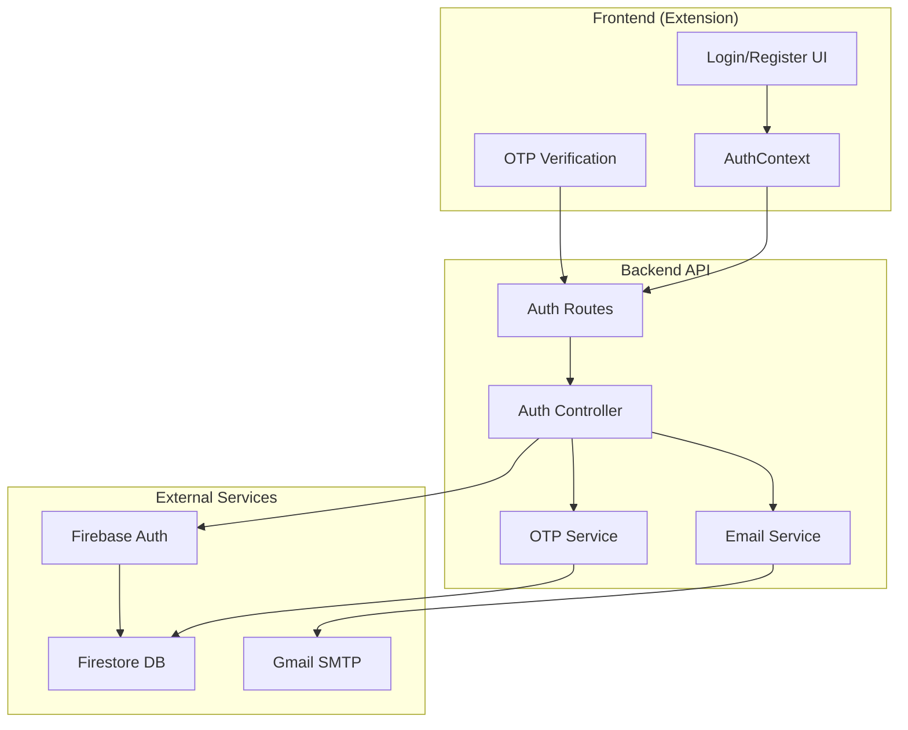

# Design Document: Email/Password Authentication

## Overview

Tính năng này mở rộng hệ thống xác thực hiện tại (chỉ Google OAuth) để hỗ trợ đăng nhập bằng email/password. Thiết kế đảm bảo tương thích ngược với cấu trúc dữ liệu user hiện có, cho phép người dùng email liên kết Google account để sử dụng Drive sync.

### Key Design Decisions

1. **Firebase Auth Integration**: Sử dụng Firebase Authentication với Email/Password provider thay vì tự xây dựng auth system
2. **OTP via Email**: Gửi mã xác thực 6 số qua email thay vì magic link để UX tốt hơn
3. **Bcrypt Hashing**: Firebase Auth tự động xử lý password hashing an toàn
4. **Backward Compatible**: User object giữ nguyên cấu trúc, thêm field `authProvider`

## Architecture



## Components and Interfaces

### 1. Backend Components

#### 1.1 Auth Controller (`backend/src/controllers/emailAuth.controller.js`)

```typescript
interface RegisterRequest {
  email: string;
  password: string;
  displayName: string;
  locale?: string;
}

interface VerifyOTPRequest {
  email: string;
  otp: string;
}

interface LoginRequest {
  email: string;
  password: string;
}

interface ResetPasswordRequest {
  email: string;
  otp: string;
  newPassword: string;
}

interface LinkGoogleRequest {
  userId: string;
  googleToken: string;
}
```

#### 1.2 OTP Service (`backend/src/services/otp.service.js`)

```typescript
interface OTPRecord {
  email: string;
  code: string;           // 6-digit code
  type: 'verification' | 'password_reset';
  expiresAt: Date;        // 10 minutes from creation
  attempts: number;       // Failed verification attempts
  createdAt: Date;
}

interface OTPService {
  generateOTP(email: string, type: string): Promise<string>;
  verifyOTP(email: string, code: string, type: string): Promise<boolean>;
  invalidateOTP(email: string, type: string): Promise<void>;
  checkRateLimit(email: string, type: string): Promise<boolean>;
}
```

#### 1.3 Email Auth Service (`backend/src/services/emailAuth.service.js`)

```typescript
interface EmailAuthService {
  register(data: RegisterRequest): Promise<{userId: string, pendingVerification: boolean}>;
  verifyEmail(email: string, otp: string): Promise<{success: boolean, token: string}>;
  login(email: string, password: string): Promise<{user: User, token: string}>;
  requestPasswordReset(email: string): Promise<void>;
  resetPassword(email: string, otp: string, newPassword: string): Promise<void>;
  linkGoogle(userId: string, googleToken: string): Promise<void>;
  unlinkGoogle(userId: string): Promise<void>;
}
```

### 2. Frontend Components

#### 2.1 Auth Components (`src/components/Auth/`)

- `EmailLoginForm.jsx` - Form đăng nhập email/password
- `EmailRegisterForm.jsx` - Form đăng ký tài khoản
- `OTPVerification.jsx` - Component nhập mã OTP
- `ForgotPassword.jsx` - Flow quên mật khẩu
- `LinkGoogleAccount.jsx` - UI liên kết Google

#### 2.2 Updated AuthContext

```typescript
interface AuthContextValue {
  user: User | null;
  isAuthenticated: boolean;
  isLoading: boolean;
  error: string | null;
  authMethod: 'google' | 'email' | null;
  
  // Existing methods
  signIn(): Promise<boolean>;           // Google sign in
  signOut(): Promise<boolean>;
  
  // New methods
  signInWithEmail(email: string, password: string): Promise<boolean>;
  registerWithEmail(email: string, password: string, name: string): Promise<{pendingVerification: boolean}>;
  verifyEmail(email: string, otp: string): Promise<boolean>;
  requestPasswordReset(email: string): Promise<void>;
  resetPassword(email: string, otp: string, newPassword: string): Promise<boolean>;
  linkGoogleAccount(): Promise<boolean>;
  unlinkGoogleAccount(): Promise<boolean>;
  
  // Status
  hasGoogleLinked: boolean;
}
```

## Data Models

### 1. User Document (Firestore: `users/{userId}`)

```typescript
interface User {
  // Existing fields (unchanged)
  email: string;
  name: string;
  tier: 'free' | 'pro' | 'enterprise';
  credits: {
    balance: number;
    purchased: number;
    used: number;
    free: number;
  };
  usage: {
    profilesCount: number;
    analysesCount: number;
    rewritesCount: number;
  };
  createdAt: Date;
  
  // New fields
  authProvider: 'google' | 'email';
  emailVerified: boolean;
  picture?: string;                    // Default avatar for email users
  
  // Google linking (for email users)
  googleLinked?: {
    googleId: string;
    googleEmail: string;
    linkedAt: Date;
    accessToken?: string;              // For Drive sync
  };
  
  // Security
  failedLoginAttempts?: number;
  lockedUntil?: Date;
  lastLoginAt?: Date;
}
```

### 2. OTP Document (Firestore: `otp_codes/{email}`)

```typescript
interface OTPDocument {
  email: string;
  code: string;                        // Hashed OTP
  type: 'verification' | 'password_reset';
  expiresAt: Timestamp;
  attempts: number;
  resendCount: number;
  lastResendAt?: Timestamp;
  createdAt: Timestamp;
}
```

### 3. Pending Registration (Firestore: `pending_registrations/{email}`)

```typescript
interface PendingRegistration {
  email: string;
  passwordHash: string;                // Bcrypt hash
  displayName: string;
  locale: string;
  createdAt: Timestamp;
  expiresAt: Timestamp;                // 24 hours
}
```

## Correctness Properties

*A property is a characteristic or behavior that should hold true across all valid executions of a system-essentially, a formal statement about what the system should do. Properties serve as the bridge between human-readable specifications and machine-verifiable correctness guarantees.*

### Property 1: Password Validation Correctness
*For any* string input, the password validation function SHALL return true if and only if the string contains at least 8 characters, at least one uppercase letter, at least one lowercase letter, and at least one number.
**Validates: Requirements 1.2**

### Property 2: Email Validation Correctness
*For any* string input, the email validation function SHALL return true if and only if the string matches standard email format (RFC 5322 simplified).
**Validates: Requirements 1.4**

### Property 3: OTP Generation Format
*For any* OTP generation request, the generated code SHALL be exactly 6 digits (000000-999999) and the expiration time SHALL be exactly 10 minutes from generation time.
**Validates: Requirements 2.1, 5.1**

### Property 4: OTP Verification Correctness
*For any* valid OTP code and email pair, verifying with the correct code before expiration SHALL return success, and verifying with incorrect code SHALL return failure and increment attempt counter.
**Validates: Requirements 2.2, 2.3**

### Property 5: OTP Invalidation on Resend
*For any* OTP resend request, the previous OTP code SHALL become invalid and a new code SHALL be generated.
**Validates: Requirements 2.5**

### Property 6: Login Authentication Correctness
*For any* registered and verified user, login with correct password SHALL return valid token, and login with incorrect password SHALL fail and increment attempt counter.
**Validates: Requirements 3.1, 3.2**

### Property 7: User Data Structure Compatibility
*For any* user created via email registration, the user object SHALL contain all fields required by AuthContext interface: userId, email, name, picture, tier, credits, and authProvider.
**Validates: Requirements 7.1, 7.2, 7.3, 7.4**

### Property 8: Duplicate Email Prevention
*For any* registration attempt with an email that exists in users collection, the registration SHALL be rejected.
**Validates: Requirements 1.3**

### Property 9: Google Link Uniqueness
*For any* Google account linking attempt, if the Google account is already linked to another user, the linking SHALL be rejected.
**Validates: Requirements 4.3**

### Property 10: Password Reset Security
*For any* password reset request, the response SHALL be identical regardless of whether the email exists in the system.
**Validates: Requirements 5.4**

### Property 11: Email Template Localization
*For any* supported locale, the email template SHALL render content in the corresponding language.
**Validates: Requirements 6.3**

### Property 12: Session Invalidation on Password Reset
*For any* successful password reset, all existing sessions for that user SHALL be invalidated.
**Validates: Requirements 5.2**

## Error Handling

### Error Codes

| Code | Description | HTTP Status |
|------|-------------|-------------|
| `AUTH_INVALID_EMAIL` | Email format không hợp lệ | 400 |
| `AUTH_WEAK_PASSWORD` | Password không đủ mạnh | 400 |
| `AUTH_EMAIL_EXISTS` | Email đã được đăng ký | 409 |
| `AUTH_INVALID_OTP` | Mã OTP không đúng | 400 |
| `AUTH_OTP_EXPIRED` | Mã OTP đã hết hạn | 400 |
| `AUTH_TOO_MANY_ATTEMPTS` | Quá nhiều lần thử | 429 |
| `AUTH_ACCOUNT_LOCKED` | Tài khoản bị khóa | 423 |
| `AUTH_EMAIL_NOT_VERIFIED` | Email chưa xác thực | 403 |
| `AUTH_INVALID_CREDENTIALS` | Email hoặc password sai | 401 |
| `AUTH_GOOGLE_ALREADY_LINKED` | Google đã liên kết user khác | 409 |
| `AUTH_RESEND_RATE_LIMITED` | Gửi lại OTP quá nhiều | 429 |

### Rate Limiting

- OTP Verification: 5 attempts per code
- OTP Resend: 3 times per hour
- Login: 5 attempts per 15 minutes
- Password Reset: 3 requests per hour

## Testing Strategy

### Unit Testing

Sử dụng Jest cho unit tests:

- Password validation function
- Email validation function
- OTP generation/verification logic
- User data transformation
- Email template rendering

### Property-Based Testing

Sử dụng **fast-check** library cho property-based tests:

- Password validation với random strings
- Email validation với random formats
- OTP format verification
- User data structure validation
- Rate limiting behavior

Mỗi property test PHẢI:
- Chạy tối thiểu 100 iterations
- Có comment reference đến correctness property trong design doc
- Format: `**Feature: email-password-auth, Property {number}: {property_text}**`

### Integration Testing

- Full registration → verification → login flow
- Password reset flow
- Google account linking flow
- Rate limiting enforcement

### Test Coverage Requirements

- Unit tests: >80% code coverage
- Property tests: All 12 correctness properties
- Integration tests: All critical user flows
